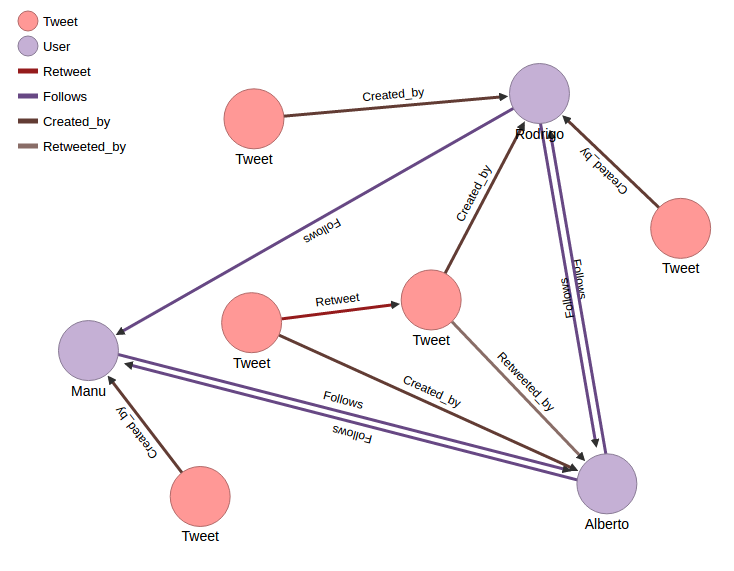

Metrics Usage
-------------

Searching for Relevant Tweets and Users
=======================================

Suppose we have 3 twitter users:
**Manu**, **Alberto** and **Rodrigo**. This three users are expressing
their opinions about a concrete topic in Twitter, i.e about nuclear
energy. They have published tweets concerning this topics and they
follow each other as it is shown in the following graph.

(This data can easily be loaded in Scaner tool using "populate\_db.py"
script).

Now let's find more information about this data. The metrics used are
based on Noro et al. article [Noro et al, 2016].

-  `Tweet Ratio <#Tweet%20Ratio>`__
-  `Influence <#Influence>`__
-  `Follow Relation <#Follow%20Relation>`__
-  `Relevance <#Relevance>`__
-  `Voice <#Voice>`__
-  `Impact <#Impact>`__

Tweet Ratio
===========

To calculate Tweet ratio of each user Scaner takes the lapse of time of
the tweets data introduced and relations the number of tweets published
in that lapse with the number of tweets related to the topic that are in
the Scaner database.

Let's calculate Rodrigo's tweet ratio. To do so we choose two intervals
of time to measure (**t0** y **t1**). In **t0** Rodrigo had 300 tweets
in his timeline. In **t1** Rodrigo had 333 tweets. Of this 33 new
tweets, 3 of them are related to nuclear energy topic and that is the
data in Scaner. So the tweet Ratio was:

.. code:: python

    import numpy as np

.. code:: python

    statuses_count_t0 = 300
    statuses_count_t1 = 333
    tweets_in_scaner = 3
    
    #TWEET RATIO
    TR = tweets_in_scaner/(statuses_count_t1-statuses_count_t0)
    TR

.. parsed-literal::

    0.09090909090909091

Influence
=========

To find out the influence of users and tweet in this data we need to
create three matrix: on one hand with the number of tweets created by
the users, on the other, with the retweets and replies and the last
matrix with the replies and the tweets created, retweeted or replied by
the followers of the users. Then Scaner calculate the influence. This
influence is normalized assigning 1 to the maximum influence value.

For our example above, Rodrigo would be the most influence user, so
Rodrigo's influence is 1. The influence vector calculated. We could
observe that the second most influent was Alberto, that is because
Alberto has retweeted a tweet from Rodrigo.

.. code:: python

    # [UI_Rodrigo UI_Manu UI_Alberto]
    UI_vector = np.array([1, 0.6, 0.8])
    UI_vector

.. parsed-literal::

    array([ 1. ,  0.6,  0.8])

To find out the influence of each tweet the process is the same, the
matrix are the same and the results are correlated to the user
influence.

Follow Relation
===============

Follow Relation shows information about the amount of follows an user
has. We can see in the graph that Alberto has the most amount of Follows
arrows, so the follow relation is 1 for Alberto. The follow Relation of
Rodrigo is the lowest. That's because Rodrigo has only one user in the
data that follow him. Let's probe this suposition calculating Scaner
Follow Relation vector:

.. code:: python

    # [FR_Rodrigo FR_Manu FR_Alberto]
    FR_vector = np.array([0.54054,0.7702, 1])
    FR_vector

.. parsed-literal::

    array([ 0.54054,  0.7702 ,  1.     ])

Relevance
=========

User Relevance
~~~~~~~~~~~~~~

User relevance is calculated with a ponderated sum of the previous ones.
Each metric has a weight depending its importance. For example, user
relevance of Rodrigo will be:

.. code:: python

    w_tr = 0.4
    w_i = 0.4
    w_fr = 0.2
    user_relevance = TR**w_tr + UI_vector[0]**w_i + FR_vector[0]**w_fr
    user_relevance

.. parsed-literal::

    1.9674710190829381

Voice
~~~~~

The voice of an user is calculated according to the quantity of tweets
and retweets the user has. There are two types of this score, voice of
tweets, and voice of retweets. The calculation of both are equivalent.
Here we are going to calculate the voice of Manuel in nuclear energy
topic:

.. code:: python

    Tweet = 1
    sigma = 1
    TI = 0.37500000161 # Calculated together with Manuel user influence
    Sumatorio_tweets = 1
    Voice_tweet = (1/(1+1))*1*TI
    Voice_tweet

.. parsed-literal::

    0.187500000805

Impact
~~~~~~

The impact score is calculated related to the user influence and the
interactions of the user in the tweets collected (Related interactions:
retweets and replies). For example the impact score of Alberto would be:

.. code:: python

    UI_Alberto = 0.8 #Calculated above
    d = 0.15 # Dumping factor
    Relate_Alberto = 1 # Alberto has retweeted one tweet
    Sigma = 1 # Smoothing parameter
    Number_tweets = 4
    IMPACT = (UI_Alberto/(Relate_Alberto+Sigma))*(1-d) + (UI_Alberto/4)*d
    IMPACT

.. parsed-literal::

    0.37

Tweet relevance
~~~~~~~~~~~~~~~

Tweet relevance is the main phase of Scaner. The porpuse of this score
is to find the relevance of a new introduced tweet in Scaner
instantaneously based on the scores calculated above. This score allow
us to rank the new tweets in real time. Let's make an easy example.

Imagine that we introduce another tweet retweeted by Alberto. We don't
need to recalculate the tweet influence score of this new tweet. We
calculate the tweet relevance as follows:

.. code:: python

    Voice_retweet_Alberto = 0.5
    VR_t = 0.5
    IR_t = 0.37
    alpha = 0.4
    Tweet_relevance = alpha*VR_t + (1-alpha)*IR_t
    Tweet_relevance

.. parsed-literal::

    0.42200000000000004

Noro, T., Ru, F., Xiao, F., & Tokuda, T. 2016. Searching for relevant
based on topic- related user activities. Journal of Web Engineering, 15
(3&4), 249-276,.
